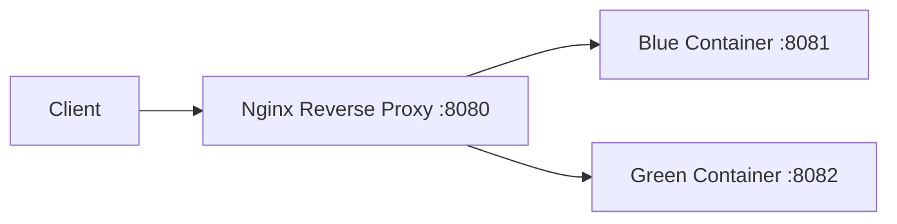
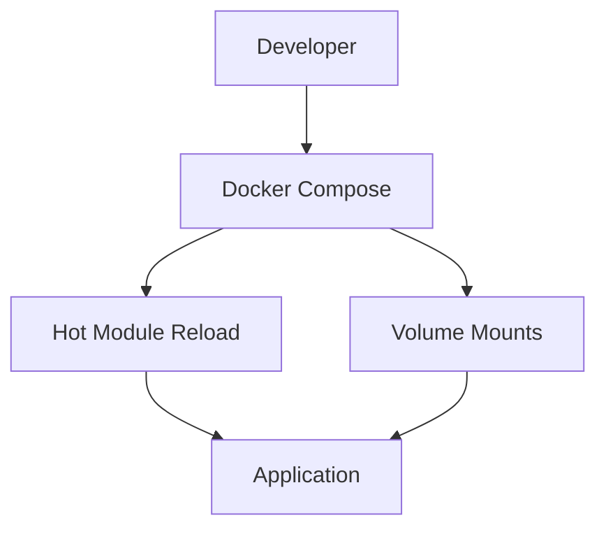
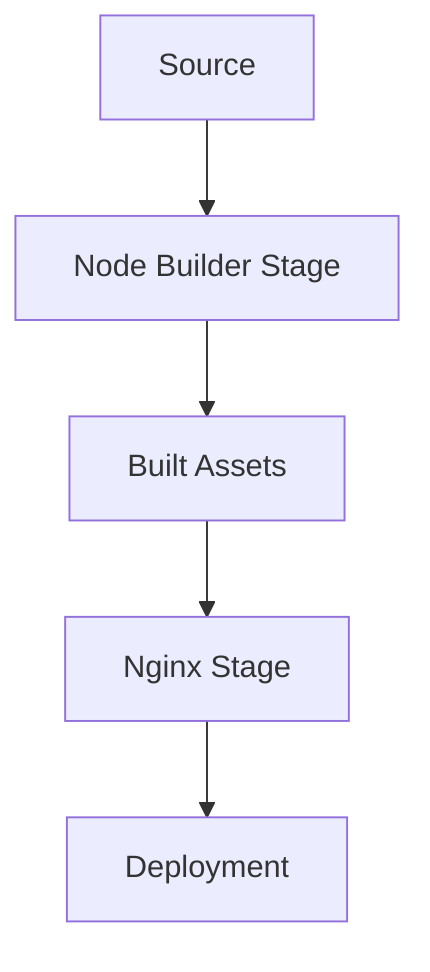

# System Patterns

## Deployment Architecture

### Container Strategy
- Blue-Green Deployment Pattern
  - Two identical environments (blue/green)
  - Zero-downtime deployments
  - Automated health checks
  - Rollback capability on failure

### Traffic Flow

### Health Check Pattern
1. Deploy new container
2. Verify health status
3. Switch traffic if healthy
4. Remove old container

### Error Handling
- Container health monitoring
- Automatic rollback on deployment failure
- Nginx error handling for 404s and static files

## Development Workflow

### Local Development

### Production Build Process

## Operating Patterns

### Container Lifecycle
1. Build new image
2. Start new container
3. Health verification
4. Traffic migration
5. Cleanup old container

### Monitoring Points
- Container health status
- Nginx proxy status
- Build process completion
- Deployment verification